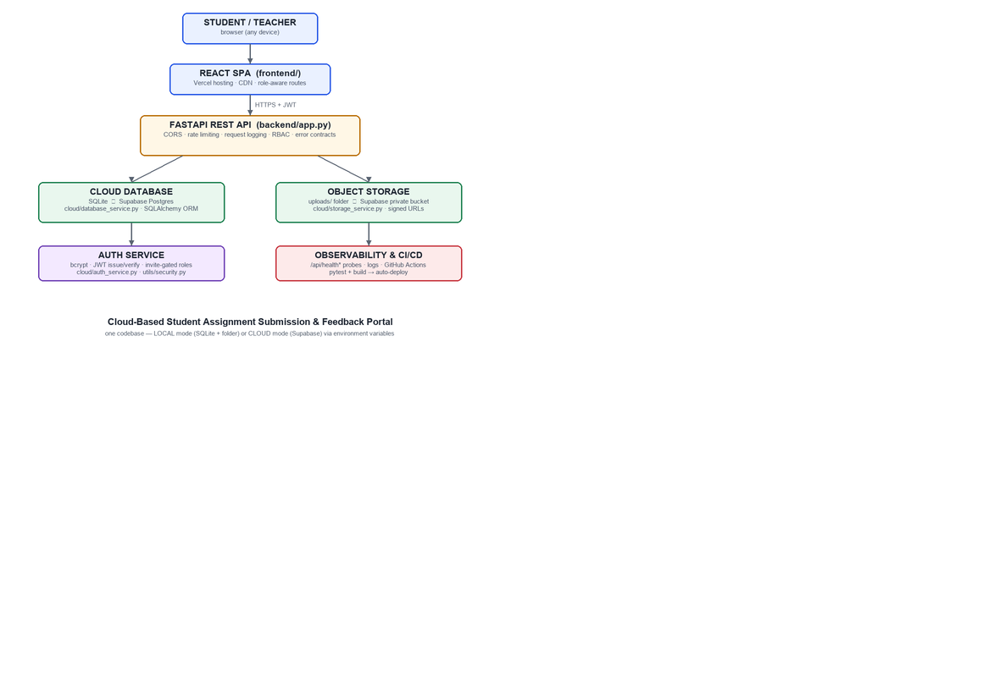

# Cloud-Based Student Assignment Submission & Feedback Portal

> A cloud-native coursework platform: role-based authentication, a cloud
> database, object storage, assignment management, deadline logic, secure
> file submission, grading and feedback — built to demonstrate **cloud
> computing concepts** end-to-end, runnable fully free (or entirely offline).



## Overview

Students upload assignments as files; teachers review them, award marks and
leave written feedback. Files live in **object storage**, all structured data
lives in a **cloud database**, and every action is authorized by **role-based
access control**. One codebase runs in two modes:

| Mode | Database | Storage | Auth | Cost |
|---|---|---|---|---|
| **LOCAL** (default) | SQLite | `uploads/` folder | own JWT (bcrypt) | ₹0 / $0, offline |
| **CLOUD** | Supabase Postgres (free) | Supabase Storage private bucket | own JWT (or Supabase Auth) | free tier |

## Problem Statement

Assignment workflows at educational institutions are traditionally managed over
email/messaging or in-person: submissions get lost, deadlines are
unenforceable, feedback is scattered, and teachers have no single view of who
submitted what. Institutional LMS platforms exist but are heavy, and small
teams cannot self-host them. What's needed is a simple, secure, centrally
logged, **cloud-hosted** system that works from anywhere on any device.

## Objectives

1. Demonstrate core cloud computing concepts in a real working system — not a toy CRUD app.
2. Provide role-based workflows for students and teachers with server-side enforcement.
3. Store files in object storage and metadata in a managed database (the correct separation).
4. Enforce deadlines with server-side timestamps and configurable late/resubmission policies.
5. Ship tests, CI, deployment configuration and documentation as part of the project.

## Features

**Students** — register/login · view assigned coursework & deadlines · upload
submissions (type/size-validated) · resubmit where allowed · track status
(NOT_SUBMITTED / SUBMITTED / LATE / GRADED) · view marks & feedback · download
their own submissions.

**Teachers** — invite-gated registration · create/manage courses & enroll
students · create/edit/delete assignments with deadline, max marks, allowed
file types/size, resubmission & late policy · view rosters of submissions ·
download submitted files · award marks + written feedback · dashboard
statistics (pending reviews, late count, recent uploads, upcoming deadlines).

**Platform** — JWT auth with bcrypt · RBAC on every route · rate limiting ·
CORS allowlist · request logging · health probes for app/db/storage ·
graceful failure handling · 49 automated tests · CI pipeline.

## User Roles & Permissions

| Capability | STUDENT | TEACHER |
|---|---|---|
| Register / login / logout | ✓ | ✓ (teacher signup needs invite code) |
| View assigned coursework + deadlines | ✓ (enrolled courses only) | ✓ (own courses) |
| Create / update / delete assignments | ✗ (403) | ✓ |
| Enroll students into courses | ✗ | ✓ |
| Upload / resubmit files | ✓ (policy-checked) | ✗ |
| View submissions | own only | all for own courses |
| Download files | own only | own courses |
| Give marks + feedback | ✗ (403; read-only otherwise) | ✓ (own courses; bounded by max_marks) |
| Dashboard | personal stats | workload stats |

## Cloud Computing Concepts (where each lives)

| Concept | In this project |
|---|---|
| SaaS | the portal consumed via browser |
| PaaS | Render (API), Vercel (SPA), Supabase (DB/Storage/Auth) |
| IaaS (mapping) | docs map every managed piece to EC2/VM/Blob equivalents |
| Cloud database | `DATABASE_URL` swap: SQLite ⇄ Postgres — `cloud/database_service.py` |
| Object storage | folder ⇄ Supabase bucket — `cloud/storage_service.py` |
| Authentication | bcrypt + JWT (`cloud/auth_service.py`) |
| Authorization / RBAC | `utils/security.py` dependencies on every route |
| REST API | 21 endpoints (`docs/api-reference.md`) |
| Client–server | React SPA ⇄ FastAPI, stateless JSON/HTTP |
| Serverless readiness | stateless handlers; Lambda/Cloud Run mapping documented |
| Scalability & elasticity | stateless app + externalized state; `docs/scalability.md` |
| Availability | managed DB backups, stateless replicas, health probes |
| Load balancing / CDN | platform edge routing; LB+ASG architecture in docs |
| API Gateway (role) | CORS + rate limiting + TLS proxy |
| Env vars & secrets | pydantic-settings, `.env.example`, no secret in git |
| Logging / monitoring | middleware logs, `/api/health*` probes, UptimeRobot |
| Backup | SQLite copy / Supabase daily backups |
| CI/CD | GitHub Actions (pytest + build) → auto-deploy |

Full table with demo evidence: `docs/cloud-concepts-mapping.md`.

## Architecture

```text
STUDENT / TEACHER (browser)
        │ HTTPS + JWT
        ▼
React SPA (Vercel / localhost:5173)
        ▼
FastAPI REST API (Render / localhost:8000)
   CORS · rate limit · logging · RBAC · error contracts
        ├──► Cloud database    (SQLite ⇄ Supabase Postgres)
        └──► Object storage    (uploads/ ⇄ Supabase private bucket)
                     ▼
        Logs, health probes, CI/CD
```

Request flows, failure paths and the AWS/Azure/GCP reference topology:
`docs/architecture.md`.

## Technology Stack

- **Frontend**: React 18 + Vite + React Router (SPA, role-aware routing)
- **Backend**: Python 3.11+ / FastAPI + SQLAlchemy 2.0 + Pydantic v2
- **Database**: SQLite (local) / Supabase Postgres (cloud)
- **Object storage**: local folder (local) / Supabase Storage (cloud)
- **Auth**: bcrypt + JWT (HS256), optional Supabase Auth mode
- **Testing**: pytest (49 tests) + live smoke script
- **CI/CD**: GitHub Actions; deploy targets Render + Vercel

## Database Design

Five tables — `users`, `courses`, `enrollments`, `assignments`, `submissions`
— with UUID primary keys, indexed foreign keys and uniqueness constraints
(`users.email`, `enrollments(course_id, student_id)`,
`submissions(assignment_id, student_id)`). Relationship chain:
`Teacher → Course → Assignment → Submission ← Student`.
ERD, indexing rationale, sample SQL and "why files don't live in the DB":
`docs/database-design.md`.

## Cloud Storage

Private bucket layout `submissions/{assignment_id}/{student_id}/{attempt}_{uuid}_{name}`,
server-side uploads with service credentials, downloads only through an
authorized endpoint (local mode) or 300-second signed URLs (cloud mode).
`docs/storage-design.md`.

## Authentication & Authorization

- **Authentication ("who are you?")**: register/login issue a signed JWT
  (sub, role, exp, jti); every request carries `Authorization: Bearer …`.
- **Authorization ("what may you do?")**: FastAPI dependency `require_roles()`
  + row-level ownership checks; students cannot reach teacher endpoints (403)
  or other students' submissions (404); teachers are confined to their courses.
- Teacher registration requires `TEACHER_INVITE_CODE` — role assignment is a
  privileged operation.

## Assignment Workflow

```
Teacher creates assignment (title, description, course, deadline,
max_marks, allowed types/size, resubmission & late policy)
        ▼  cloud database
Student dashboard shows it (enrolled only)
        ▼
Student uploads file ──► validated (ext/size/magic bytes)
        ▼  object storage (private)
Metadata row saved (status SUBMITTED or LATE, server UTC clock)
        ▼
Teacher reviews roster ──► downloads file ──► grades + feedback
        ▼  cloud database
Student views marks & feedback; downloads own file anytime
```

## REST APIs

21 endpoints across auth, courses, assignments, submissions, grading,
dashboards and health — full request/response/error contract per endpoint in
`docs/api-reference.md`. Interactive Swagger UI at `/docs` when running.

## Folder Structure

```
Cloud-Assignment-Submission-Portal/
├── backend/
│   ├── app.py                # FastAPI factory (CORS, logging, routers)
│   ├── config.py             # env-driven settings (no hardcoded secrets)
│   ├── database.py           # engine/session from DATABASE_URL
│   ├── models/               # user, course+enrollment, assignment, submission
│   ├── schemas/              # Pydantic request/response contracts
│   ├── routes/               # auth, courses, assignments, submissions, dashboards, health
│   ├── services/             # dashboard aggregates
│   ├── middleware/           # logging, error handlers, rate limiting
│   ├── cloud/                # storage_service, auth_service, database_service (providers)
│   ├── utils/                # validators, deadline, security (RBAC)
│   └── seed_demo.py          # dummy data seeder
├── frontend/                 # React SPA (Vite)
│   └── src/{api,services,context,components,pages,utils}
├── tests/                    # pytest suite (49 tests) + conftest
├── scripts/                  # smoke_test.py (17-check live E2E)
├── sample_files/             # dummy submission files
├── screenshots/              # 27-item proof checklist (see docs/github-proof-plan.md)
├── docs/                     # architecture, concepts, api, db, storage, security,
│                             # scalability, failure handling, deployment, test plan,
│                             # local guide, github plan, report, interview prep, resume
├── reports/                  # manual test results + project report copy
├── .github/workflows/ci.yml  # pytest + frontend build
├── .env.example / .env.cloud.example
└── requirements*.txt, pytest.ini, .gitignore
```

## Installation & Local Setup

Prereqs: Python 3.11+, Node 18+, Git.

```bash
git clone https://github.com/<you>/Cloud-Assignment-Submission-Portal.git
cd Cloud-Assignment-Submission-Portal

python -m venv .venv
.venv\Scripts\activate              # macOS/Linux: source .venv/bin/activate
pip install -r requirements.txt -r requirements-dev.txt

cp .env.example .env                # defaults work for local mode

uvicorn backend.app:app --reload --port 8000     # Terminal 1
```

```bash
cd frontend
npm install
npm run dev                         # Terminal 2 → http://localhost:5173
```

Seed dummy data (Terminal 3): `python -m backend.seed_demo`
→ teacher `teacher@demo.edu` / `Teacher@12345`, students
`student1..6@demo.edu` / `Student@12345`, course + 4 assignments.

Step-by-step 18-step walkthrough with expected outputs:
`docs/local-simulation-guide.md`.

## Environment Variables

See `.env.example` (local) and `.env.cloud.example` (cloud). Key vars:
`SECRET_KEY`, `DATABASE_URL`, `STORAGE_PROVIDER`, `UPLOAD_DIR`,
`MAX_FILE_SIZE_MB`, `TEACHER_INVITE_CODE`, `CORS_ORIGINS`, and the
`SUPABASE_*` set for cloud mode. **Never commit `.env`.**

## Running the Application

| URL | What |
|---|---|
| http://localhost:5173 | the web app |
| http://localhost:8000/docs | interactive API docs |
| http://localhost:8000/api/health | liveness probe |

## Testing

```bash
pytest -v                        # 49 automated tests
python scripts/smoke_test.py     # 17 live end-to-end checks (server running)
```
Manual 25-case matrix: `docs/test-plan.md`; recorded results go to
`reports/manual-test-results.md`.

## Cloud Deployment (free tier)

Render (API) + Vercel (SPA) + Supabase (Postgres + Storage) — full 35-minute
guide with exact settings: `docs/cloud-deployment.md`. Advanced AWS/Azure/GCP
mapping table included. CI (`.github/workflows/ci.yml`) runs tests on every
push; hosting auto-deploys from `main`.

## Security

bcrypt hashing · JWT expiry · RBAC + row-level checks · invite-gated teacher
roles · extension+magic-byte+size upload validation · private storage with
signed URLs · path-traversal guards · CORS allowlist · rate limiting ·
input validation · env-based secrets · request logging · no user enumeration.
Details & common-mistakes table: `docs/security.md`.

## Scalability

Why the design scales (stateless API + externalized state), and concrete
plans for 10 / 1,000 / 100,000 students including a deadline-crush scenario
with load balancers, autoscaling, managed DB replicas, caching, queues and
background workers: `docs/scalability.md`.

## Failure Handling

Per-failure catalogue (storage outage, DB down, token expiry, duplicate
requests, mid-upload disconnects, process crash), the storage-first
transactional workflow, retry policies and idempotency design:
`docs/failure-handling.md`.

## Screenshots

Capture the 27-item proof list into `screenshots/` with the professional
filenames given in `docs/github-proof-plan.md` (folder structure, login,
dashboards, upload, storage object, DB record, grading, RBAC denial, tests,
deployment, commits, README).

## Results

- 49/49 automated tests green; 17/17 live smoke checks green.
- Full workflow verified: register → enroll → assign → submit → validate →
  download → grade → feedback, with RBAC denials proven at every boundary.
- Zero-cost deployment path documented and exercised; offline mode fully
  functional without any cloud account.

## Limitations

- Free-tier hosts sleep after idle (cold start on first request).
- In-memory rate limiting suits single-instance deployments (Redis for scale-out).
- No email notifications (design note included for a worker-based extension).
- Malware scanning is structural (magic bytes) — async AV pipeline documented.
- Stateless JWT logout (client-side discard) — revocation strategy in docs.

## Future Improvements

Refresh tokens + revocation · pre-signed direct uploads · async AV scanning ·
email/webhook notifications via queues · plagiarism heuristics · group
submissions · rubric-based grading · audit log export · multi-tenancy ·
IaC (Terraform) for one-command infra.

## Learning Outcomes

- Designing a provider-abstraction layer so cloud vendor = environment variable.
- Correct separation of object storage vs database, and why it matters.
- Server-side enforcement of authn/authz/deadlines over untrusted clients.
- Operational readiness: health probes, logging, graceful failure, CI/CD.
- Communicating architecture: docs, diagrams, tests and a deployable artifact.

## Author

**Khadeejath Sana** — Cloud Computing course project.
GitHub: [K-SANA-ezlyn](https://github.com/K-SANA-ezlyn)
