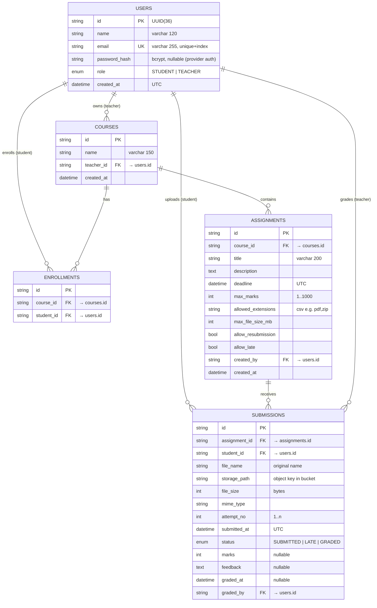

# Database Design

## 1. Entity-Relationship diagram



## 2. Keys and relationships

- **Primary keys** — UUID strings (36 chars): globally unique, safe in URLs and
  object-storage keys, no auto-increment leakage of business volume.
- **Foreign keys** — `courses.teacher_id → users.id`, `enrollments.course_id/student_id`,
  `assignments.course_id/created_by`, `submissions.assignment_id/student_id/graded_by`.
- **Relationship chain**: `Teacher → Course → Assignment → Submission ← Student`
  (and `Teacher grades Submission`). Many-to-many student↔course resolved via `enrollments`.
- **Uniqueness constraints** — `users.email` (unique index), `enrollments(course_id, student_id)`,
  `submissions(assignment_id, student_id)` — the latter makes "one live submission per
  student per assignment" a *database guarantee*, not just application logic.

## 3. Indexing strategy

| Index | Query it serves |
|---|---|
| `users.email` (unique) | login lookup by email |
| `courses.teacher_id` | teacher's course list |
| `enrollments.course_id` / `enrollments.student_id` | class rosters, student's courses |
| `assignments.course_id` | assignment lists per course |
| `submissions.assignment_id` | teacher's review roster |
| `submissions.student_id` | "my submissions" |
| composite `(assignment_id, student_id)` (unique) | resubmission lookup, status checks |

All FK columns are indexed (declared in the models), so every dashboard
aggregate and authorization check is an index-backed lookup.

## 4. Why files are NOT stored in the database

| Storing files as BLOBs | Storing files in object storage |
|---|---|
| Bloats DB files → backups grow unbounded | DB stays small, backup fast |
| Streaming a 10 MB file loads it through the DB process | storage serves bytes directly, signed URLs, CDN-able |
| Expensive DB IOPS/memory for binary I/O | cheap, durable, massively parallel object store |
| Hard to serve with proper content headers/range requests | native download semantics |

**Rule implemented**: DB stores *metadata* (who, what, where, when, status,
marks, feedback); object storage stores *bytes*. `submissions.storage_path`
is the join between the two worlds.

## 5. Cloud database queries (examples)

```sql
-- student dashboard: pending count
SELECT COUNT(*) FROM assignments a
JOIN enrollments e ON e.course_id = a.course_id
LEFT JOIN submissions s ON s.assignment_id = a.id AND s.student_id = :me
WHERE e.student_id = :me AND s.id IS NULL;

-- teacher roster for grading
SELECT s.*, u.name AS student_name
FROM submissions s JOIN users u ON u.id = s.student_id
JOIN assignments a ON a.id = s.assignment_id
JOIN courses c ON c.id = a.course_id
WHERE c.teacher_id = :teacher AND a.id = :assignment;

-- deadline sweep (background worker in production)
SELECT id FROM assignments WHERE deadline < now() AND allow_late = false;
```

The ORM (SQLAlchemy 2.0) emits equivalent queries; switching from SQLite to
Supabase Postgres changes **zero** application code — only `DATABASE_URL`.

## 6. NOT_SUBMITTED is computed, never stored

A row exists only after an upload. "Not submitted" is derived by comparing
assignments against existing submission rows (LEFT JOIN pattern above).
This avoids a synchronization problem entirely: there is no stale flag to
update when an assignment is created or a student enrolls late.
